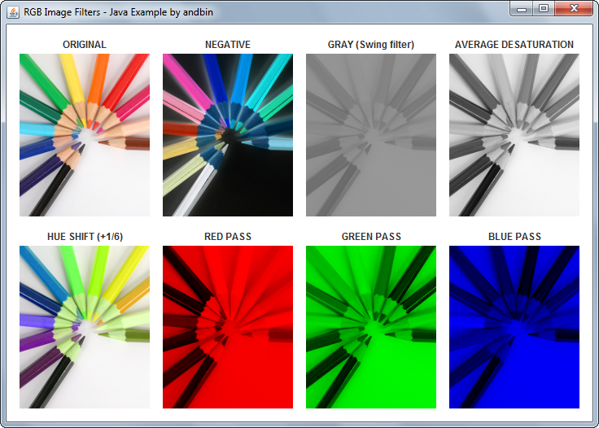

# RGB Image Filters

This example shows how to filter images using "RGB image filters", which are
extensions of the `java.awt.image.RGBImageFilter` class.

The example code uses one predefined filter (`javax.swing.GrayFilter`) and the
following four custom filters:

* `AverageDesaturationImageFilter`: a filter for an "average" desaturation using
  the classic formula *Gray = (Red + Green + Blue) / 3* .
* `ColorMaskImageFilter`: a filter that applies a "mask" of bits.
* `HueShiftImageFilter`: a filter that shifts the "hue" component by a value.
* `NegativeImageFilter`: a filter that gives the negative of the colors.

With a little amount of code added, a simple Swing frame shows a demonstration
of the original image and seven filtered images (GUI is clearly *not* the main
point of this Java Example).

### Requirements

* Java 1.4 or higher

### Screenshots

### Credits

The *colored pencils* image is derived from the original photo "Lapis de Cor"
produced by **Heitor Jose** ("tchor1974"). Please see:

* http://www.freeimages.com/photo/lapis-de-cor-1155223

### Downloads

* Sources zip archive: [rgb-image-filters-src.zip](dist/rgb-image-filters-src.zip?raw=true)
