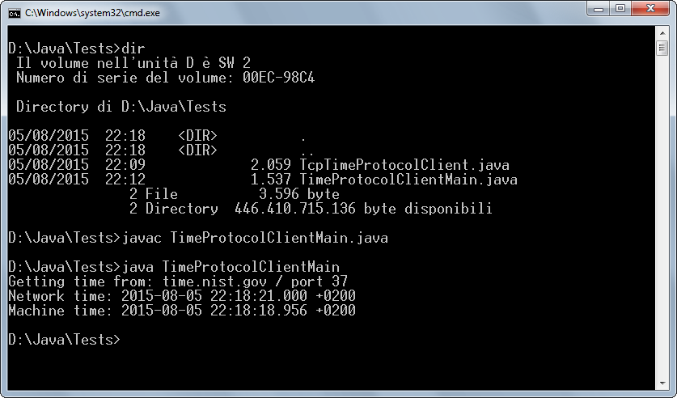

# Time Protocol Client

This example shows how to create a simple "client" for the
[Time Protocol](http://en.wikipedia.org/wiki/TIME_protocol). See also
[RFC-868](https://tools.ietf.org/html/rfc868).

### Requirements

* Any Java version

### Screenshots

