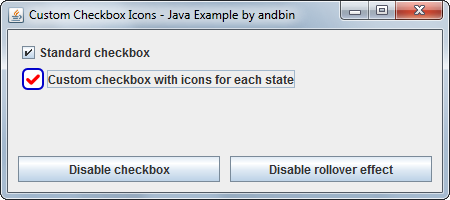

# Custom Checkbox Icons

This example shows how to create a custom checkbox (extending `javax.swing.JCheckBox`)
with custom icons for all the possible states.

The user can test all the states with the help of two buttons. One enables/disables
the checkboxes and the other enables/disables the "rollover" effect.

### Requirements

* Java 1.4 or higher

### Screenshots

