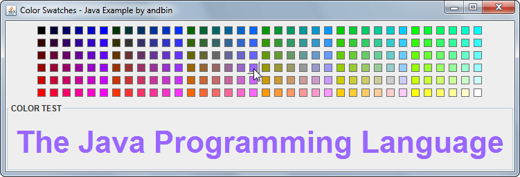

# Color Swatches

This example shows how to create a "color swatches" panel (a grid showing color
samples that the user can select from).

This is also a good example about:

* how to create a custom implementation of `javax.swing.Icon` to realize a
  simple colored "box" icon.
* how to create a custom implementation of `javax.swing.border.Border` to realize
  a "flat" button border.
* how to define and use a custom listener to receive notification of color changes
  (I have used the same classes and same logic you can also find in the
  [RGB Color Slider](../../slider/rgb-color-slider) example).

### Requirements

* Java 5 or higher

### Screenshots

