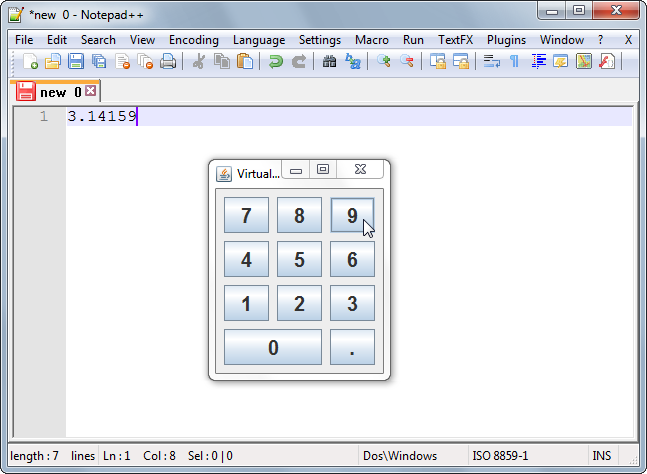

# Virtual Keypad

This example shows how to create a "virtual" keypad that injects keystrokes into
the system using the well known `java.awt.Robot` class.

### Requirements

* Java 5 or higher

### Screenshots

