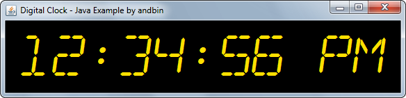

# Digital Clock

This example shows how to load a custom TrueType font to create a simple
"digital" clock with the help of the `javax.swing.Timer` class.

### Requirements

* Java 1.4 or higher

### Screenshots

**Note**: the format of the text in the clock depends on your *locale*.
The screenshot above shows the clock using the english locale.

### Credits

The "Digital dream" font used in the example is designed and copyrighted by
Jakob Fischer / [pizzadude.dk](http://www.pizzadude.dk).

I found the font [here](http://www.fontsquirrel.com/fonts/Digital-dream)
at Font Squirrel.
