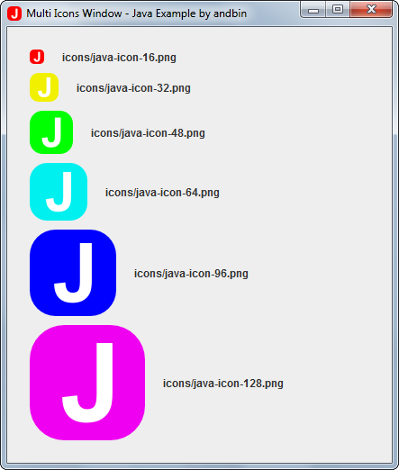

# Multi Icons Window

This example shows how to apply a list of images to a `javax.swing.JFrame` for
the window icon so that the platform/Operating System can choose the most
appropriate icon(s) from the list.

The icons are expressly in different colors so that you can clearly see how/where
the platform/Operating System uses them.

This example uses the new `setIconImages(List<? extends Image> icons)` method
available since Java 6 in `java.awt.Window` and all subclasses.

### Requirements

* Java 6 or higher

### Screenshots

### Notes

The six icon images are developed by **me**, you are free to reuse them for
whatever you want. I deliberately release these icons as "freeware".
