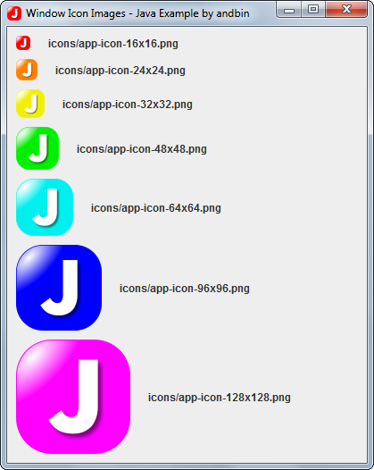

# Window Icon Images

This example shows how to apply a list of images to a `javax.swing.JFrame` for
the window icon so that the *Operating System* can choose the most appropriate
icon(s) from the list.

The code uses the new `setIconImages(List<? extends Image> icons)` method
available since Java 6 in `java.awt.Window` and all subclasses (like `javax.swing.JFrame`
and `javax.swing.JDialog`).

The icons in this example are expressly in different colors so that you can
clearly see how/where are used by the *Operating System*.

### Requirements

* Java 6 or higher

### Screenshots

### Notes

The seven icon images are created by **me**, you are free to reuse them for
whatever you want. I release these icons as "freeware".

### Downloads

* Sources zip archive: [window-icon-images-src.zip](dist/window-icon-images-src.zip?raw=true)
