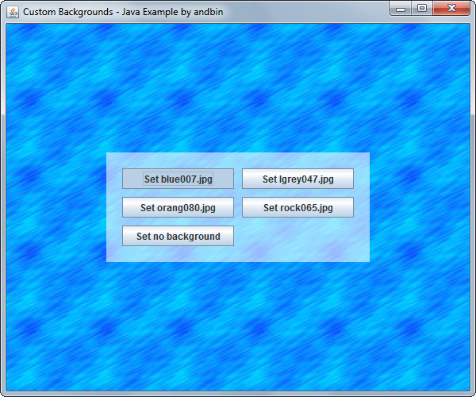
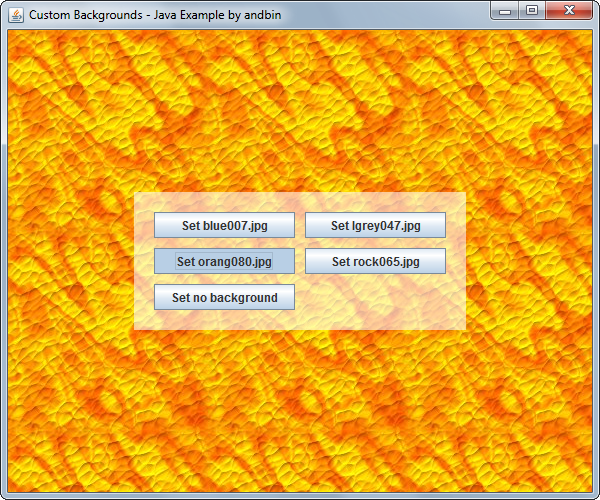

# Custom Backgrounds

This example shows how to use the *custom painting* in a component that extends
`javax.swing.JPanel` to create some nice background effects:

* A background formed by repeating a "tile" image (see the `TiledImagePanel` class).
* A background formed by a single uniform color that can also be semi-transparent
  (see the `AlphaColorPanel` class).

### Requirements

* Java 5 or higher

### Screenshots

### Credits

The four "tile" images are available at [http://www.grsites.com](http://www.grsites.com):

* [blue007.jpg](http://www.grsites.com/archive/textures/view/source=archive/id=696/)
* [lgrey047.jpg](http://www.grsites.com/archive/textures/view/source=archive/id=2193/)
* [orang080.jpg](http://www.grsites.com/archive/textures/view/source=archive/id=308/)
* [rock065.jpg](http://www.grsites.com/archive/textures/view/source=archive/id=3451/)
