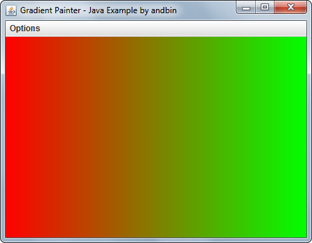

# Gradient Painter

This example shows how to draw a linear gradient using the `java.awt.GradientPaint`
class. The two end colors and the orientation (horizontal vs vertical) can be
selected by the user with some menu options.

This is also a good example about how to create a menu with normal items, radio
button items and a separator. And it is also an example about the basic use of
the `javax.swing.JColorChooser` class.

### Requirements

* Java 5

### Screenshots

