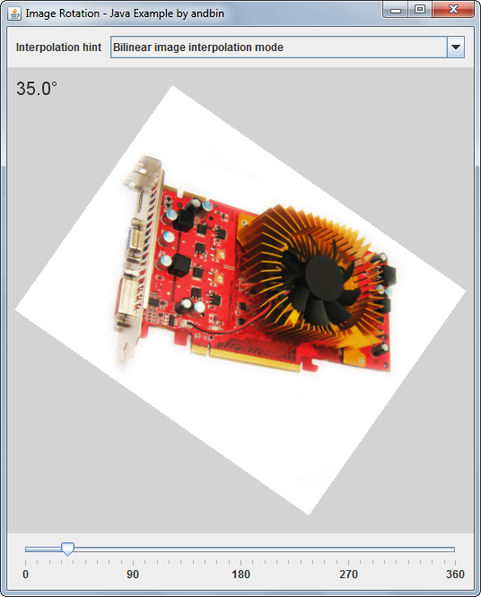

# Image Rotation

This example shows how to draw an image that can be rotated from 0 to 360 degrees.
The user can change the rotation angle (in degrees) using a `JSlider` component
and can select the &ldquo;interpolation&rdquo; hint (controls how image pixels
are filtered/resampled during an image rendering).

### Requirements

* Java 1.4 or higher

### Screenshots

### Credits

The &ldquo;video card&rdquo; image is derived from original photo produced
by Marin Myftiu ('marinm'). Please see:

* http://www.freeimages.com/photo/1046658
