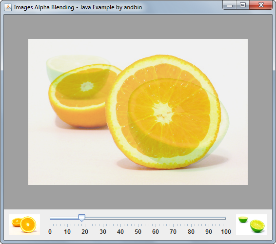
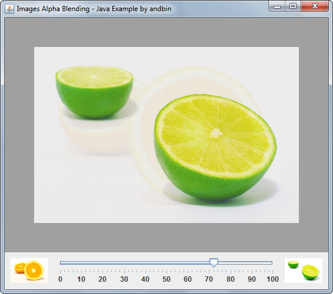

# Images Alpha Blending

This example shows how to use the `java.awt.AlphaComposite` class to blend two
different images. The alpha level of both images is controllable by a single
`javax.swing.JSlider` component.

### Requirements

* Java 1.4 or higher

### Screenshots

### Credits

The "Orange" and "Lime" images are derived from original photos produced by
Paul Bodea ('paulgeor'). Please see:

* http://www.freeimages.com/photo/251024
* http://www.freeimages.com/photo/251025
