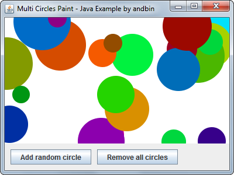

# Multi Circles Paint

This example shows how to paint an **arbitrary** number of circles with different
position/radius/color.

You can add a new random circle using the "Add random circle" button. Position,
radius and color of the circle are calculated **randomly** with the help of the
well known `Math.random()` method. You can also remove all the circles with the
"Remove all circles" button, that erases the entire panel.

### Requirements

* Java 5 or higher

### Screenshots

### Downloads

* Sources zip archive: [multi-circles-paint-src.zip](dist/multi-circles-paint-src.zip?raw=true)
