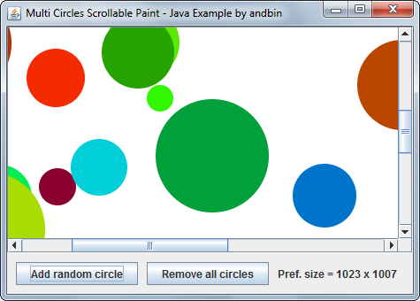

# Multi Circles Scrollable Paint

This example shows how to paint an **arbitrary** number of circles with different
position/radius/color in a "scrollable" panel.

You can add a new random circle using the "Add random circle" button. Position,
radius and color of the circle are calculated **randomly** with the help of the
well known `Math.random()` method. You can also remove all the circles with the
"Remove all circles" button, that erases the entire panel.

**NOTE**: This example is very similar to the other example
[Multi Circles Paint](../multi-circles-paint) but with an important difference.
While the `MultiCirclesPaintPanel` in the other example is directly contained
into the *content pane*, this `MultiCirclesScrollablePaintPanel` is used as
"view" component into `JScrollPane`.

When a new circle is added, the "preferred" size of the panel is updated (if
necessary) and then a call to `revalidate()` is executed (again, only if
necessary). `revalidate()` **is different** from the basic `validate()`.
`revalidate()` finds the first "validateRoot" in the containment hierarchy.
`JScrollPane` **IS** (by design) a validateRoot, thus the re-validation of
layout starts from `JScrollPane` and not just only from the
`MultiCirclesScrollablePaintPanel`.

Please, see details in the javadoc documentation for
[**revalidate()**](https://docs.oracle.com/javase/8/docs/api/javax/swing/JComponent.html#revalidate--).

### Requirements

* Java 5 or higher

### Screenshots

### Downloads

* Sources zip archive: [multi-circles-scrollable-paint-src.zip](dist/multi-circles-scrollable-paint-src.zip?raw=true)
