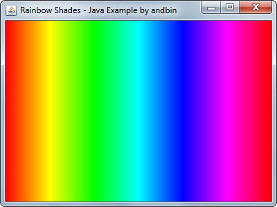
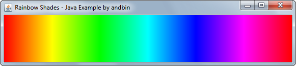

# Rainbow Shades

This example shows how to fill a panel with "rainbow" shades. Each 1 pixel wide
vertical line is drawn with a color calculated using the `Color.getHSBColor`
method.

### Requirements

* Java 1.4 or higher

### Screenshots

