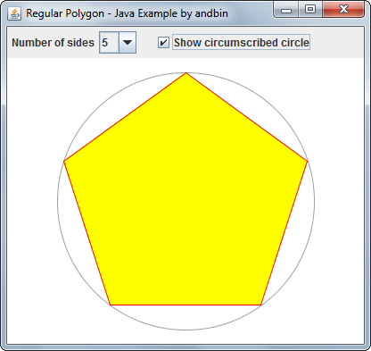

# Regular Polygon

This example shows how to draw a "regular" polygon using the `Path2D.Double`
class. The user can select the number of sides and can show/hide the
circumscribed circle.

### Requirements

* Java 6 or higher

### Screenshots

