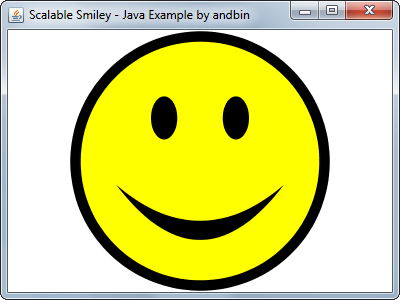
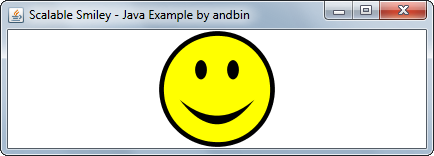

# Scalable Smiley

This example shows how to draw a *scalable* "smiley" using the Java 2D API and the
custom painting in a class that extends `JPanel`.

If you resize the frame, the smiley will scale proportionally in the correct way.

### Requirements

* Java 1.4 or higher

### Screenshots

