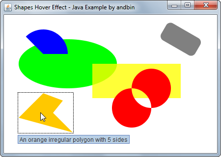

# Shapes Hover Effect

This example shows how to use the *custom painting* and the `MouseListener`/`MouseMotionListener`
listeners to create a simple "hover" effect on a set of shapes.

If you move the mouse cursor on a shape: **a)** a dashed rectangle highlights the shape
and **b)** a tooltip is shown (possibly after some delay).

### Requirements

* Java 5 or higher

### Screenshots

