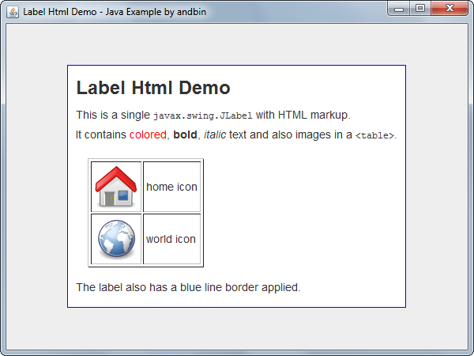

# Label Html Demo

This example shows how to use HTML markup in a `javax.swing.JLabel` component.

### Requirements

* Java 1.4 or higher

### Screenshots

### Credits

The "home" and "world" icon images are derived from original icons available
in the *Tango Icon Library* set, licensed under Attribution-Non-Commercial 3.0
Netherlands. Please see:

* https://www.iconfinder.com/iconsets/tango-icon-library

### Downloads

* Sources zip archive: [label-html-demo-src.zip](dist/label-html-demo-src.zip?raw=true)
