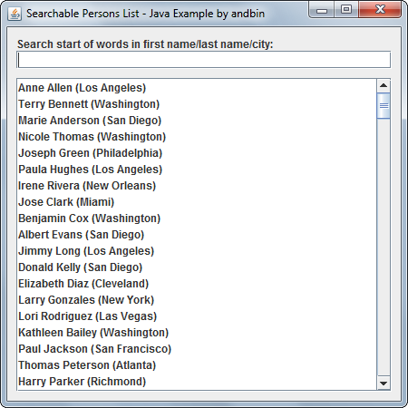
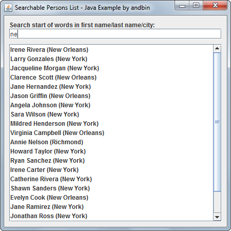
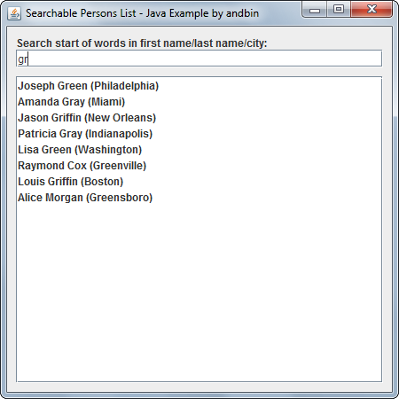

# Searchable Persons List

This example shows how to create a list (`javax.swing.JList`) in which the items
can be searched using a specific search rule.

In this example, the items are `Person` objects (with properties *first name*,
*last name* and *city*) and the search rule is defined to match some text at the
start of words into the three properties.

The central point of this example is the `SearchableListModel` class that is
a custom implementation of the `javax.swing.ListModel` interface (extending
`javax.swing.AbstractListModel` only for convenience).

This class is a "generic" list model in which the items can be searched and
filtered using a filter strategy represented by the `SearchableListFilter`
interface.

### Requirements

* Java 5 or higher

### Screenshots

