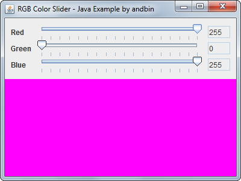

# RGB Color Slider

This example shows how to create a simple color "chooser" with three slider
(`javax.swing.JSlider` class) components for the red, green and blue values.
This chooser is well encapsulated in a class that extends `javax.swing.JPanel`.

This is also a good example about how to define and use a custom listener,
in the same/similar way as the AWT/Swing listeners.

### Requirements

* Java 1.4 or higher

### Screenshots

