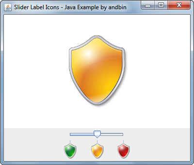

# Slider Label Icons

This example shows how to setup a *label table* for a `JSlider` in order to
have ticks with icons instead of numbers.

### Requirements

* Java 1.4 or higher

### Screenshots

### Credits

The "shield" icons are derived from original icons in the **Vista Style Base Software**
icons set developed by **[Icons Land](http://www.icons-land.com/)**.
