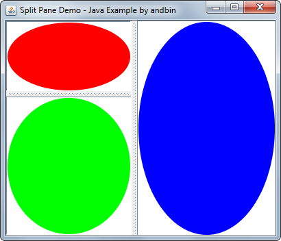

# Split Pane Demo

This example shows how to use the `javax.swing.JSplitPane` component both in
the vertical and horizontal orientations.
The components into `JSplitPane` are instances of a simple class `EllipsePaintPanel`
(extension of `javax.swing.JPanel`) that draws an ellipse sized to fit the
component surface.

**Hint**: try the source code and "play" with minimum sizes, the *resizeWeight*
property and also try the difference between `setContinuousLayout(true)` and
`setContinuousLayout(false)`.

### Requirements

* Java 1.4 or higher

### Screenshots

### Downloads

* Sources zip archive: [splitpane-demo-src.zip](dist/splitpane-demo-src.zip?raw=true)
