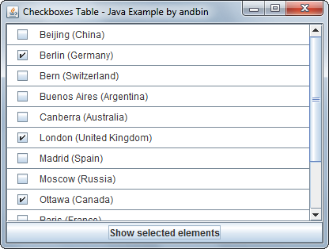

# Checkboxes Table

This example shows how to create a nice and useful table of items selectable
using checkboxes. The main point of this example is a custom and *generic*
(in the sense of Java 5 "generics") implementation of a table model as extension
of the `javax.swing.table.AbstractTableModel` class.

### Requirements

* Java 5 or higher

### Screenshots

