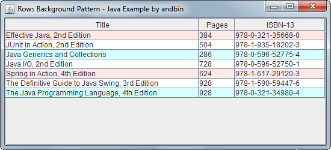
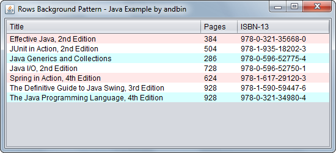

# Rows Background Pattern

This example shows how to extend the `javax.swing.JTable` component in order to
apply a (repeating) pattern of background colors for the rows.

### Requirements

* Java 5 or higher

### Screenshots

 (sample with the standard "Metal" Look and Feel)

---

 (sample with the new "[Nimbus](https://docs.oracle.com/javase/tutorial/uiswing/lookandfeel/nimbus.html)" Look and Feel)
