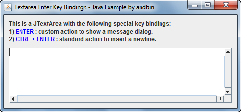

# Textarea Enter Key Bindings

This example shows how to setup the `Keymap` of a `JTextArea` to change the
behaviour of the ENTER key. See source code and screenshot for a more complete
description.

### Requirements

* Java 1.4 or higher

### Screenshots

### Downloads

* Sources zip archive: [textarea-enter-key-bindings-src.zip](dist/textarea-enter-key-bindings-src.zip?raw=true)
