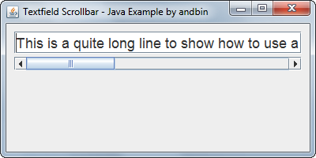

# Textfield Scrollbar

This example shows how to use a single `JScrollBar` component to handle the
scrolling of the text in a `JTextField` component.

### Requirements

* Java 1.4 or higher

### Screenshots

