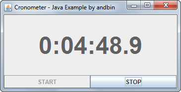

# Cronometer

This example shows how to create a simple cronometer with start/stop buttons.
The main point of this example is the use of the `javax.swing.Timer` class to
fire timing events at a rate of 20 per second.

I have also decided to use a "strategy" interface named `ElapsedTimeFormatter`
to decouple the class that shows the cronometer from the logic that knows how to
format the elapsed time. There is a default implementation of this interface to
format the elapsed time in hours/minutes/seconds/tenths of second.

### Requirements

* Java 5 or higher

### Screenshots

### Downloads

* Sources zip archive: [cronometer-src.zip](dist/cronometer-src.zip?raw=true)
