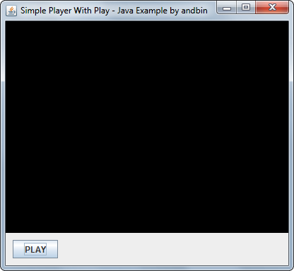
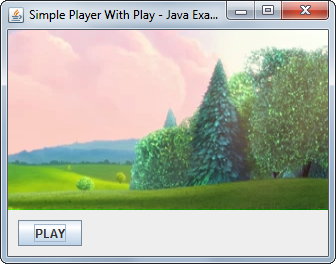

# Simple Player With Play

This example shows how to create a simple video player with only a play button
using the [vlcj](https://github.com/caprica/vlcj) framework.

The code makes direct use of the `Canvas` AWT component and also of the
`MediaPlayerFactory` and `EmbeddedMediaPlayer` classes from vlcj.

### Requirements

* Java 6 or higher (due to vlcj requirements)
* VideoLAN VLC 2.1.0 or higher (see detailed requirements on vlcj github page)

### Screenshots

### Notes

This example is based on vlcj **3.10.1** (referenced as Maven *dependency*).

If you want to play the video as referenced in this example, you need an internet
connection of at least 1~1.5 Mbit/sec.

### Credits

vlcj is distributed according to the terms of the [GPL](http://www.gnu.org/licenses/gpl.html)
license.

The video linked and played in this example is available at [peach.blender.org/download/](https://peach.blender.org/download/). 
&copy; copyright 2008, Blender Foundation / www.bigbuckbunny.org
