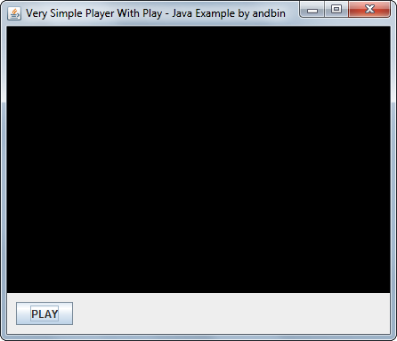
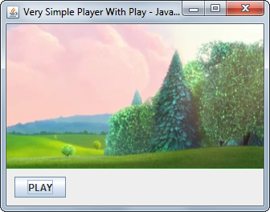

# Very Simple Player With Play

This example shows how to create a *very* simple video player with only a play
button using the [vlcj](https://github.com/caprica/vlcj) framework.

The code mainly uses the `EmbeddedMediaPlayerComponent` class from vlcj.
Note that this example does **not** directly use the `java.awt.Canvas` nor the
`MediaPlayerFactory`/`EmbeddedMediaPlayer` classes from vlcj. If you want to
see an example about these classes, please see the other example
[simple-player-with-play](../simple-player-with-play).

### Requirements

* Java 6 or higher (due to vlcj requirements)

### Screenshots

### Notes

This example is based on vlcj **3.10.1** (referenced as Maven *dependency*).

If you want to play the video as referenced in this example, you need an internet
connection of at least 1~1.5 Mbit/sec.

### Credits

The video linked and played in this example is available at [peach.blender.org/download/](https://peach.blender.org/download/). 
&copy; copyright 2008, Blender Foundation / www.bigbuckbunny.org
